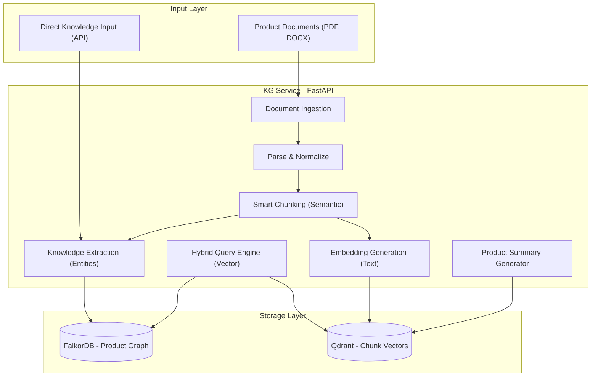

# Product Knowledge Graph Service

A hybrid **knowledge graph + vector search** service for product documentation.  
Ingests PDF, DOCX, PPTX, XLSX, TXT files and builds a queryable product KG with semantic search.

## Architecture



**Stack**: FastAPI · FalkorDB · Qdrant · Azure OpenAI (via LiteLLM) · `uv`

---

## Quick Start

### 1. Environment

```bash
cp .env.example .env
# Fill in your Azure OpenAI credentials
```

### 2. Start Infrastructure + Service

**Full Docker stack** (recommended):
```bash
docker compose up -d
```

**Dev mode** (databases in Docker, app locally):
```bash
# Start FalkorDB + Qdrant
docker compose up -d falkordb qdrant

# Install deps & run
uv sync
uv run uvicorn kg_service.main:app --reload --host 0.0.0.0 --port 8000
```

### 3. Open Docs

Visit **http://localhost:8000/docs** for interactive API documentation.

---

## API Endpoints

| Method | Endpoint | Description |
|--------|---------|-------------|
| `POST` | `/ingest/upload` | Upload one or more PDF documents |
| `POST` | `/ingest/text` | Ingest raw text |
| `GET` | `/ingest/status/{task_id}` | Check ingestion progress |
| `DELETE` | `/ingest/document/{source_file}` | Remove document from KG |
| `POST` | `/query/ask` | Ask a question (hybrid search + LLM) |
| `POST` | `/query/search` | Semantic search over chunks |
| `GET` | `/query/product/{name}` | Get product's KG data |
| `GET` | `/query/product/{name}/summary` | Generate sales summary |
| `POST` | `/query/compare` | Compare products |
| `POST` | `/knowledge/product` | Add/update product (name only required) |
| `POST` | `/knowledge/feature` | Add feature to product |
| `POST` | `/knowledge/note` | Free-text note → auto-extracted |
| `GET` | `/knowledge/products` | List all products |
| `GET` | `/health` | Service health + DB status |
| `GET` | `/health/stats` | KG statistics |

---

## Usage Examples

### Upload Documents (PDF Only)
```bash
curl -X POST http://localhost:8000/ingest/upload \
  -F "files=@ibm-watson-studio-datasheet.pdf" \
  -F "files=@ibm-watson-studio-overview.pdf" \
  -F "product_name=Watson Studio"
```

### Ask a Question
```bash
curl -X POST http://localhost:8000/query/ask \
  -H "Content-Type: application/json" \
  -d '{
    "question": "What problems does Watson Studio solve?",
    "top_k": 5,
    "include_sources": true
  }'
```

### Add Product Knowledge (Sales Team)
```bash
curl -X POST http://localhost:8000/knowledge/product \
  -H "Content-Type: application/json" \
  -d '{
    "name": "Watson Studio",
    "category": "AI/ML",
    "problems_solved": ["Manual model training", "Data silos"],
    "value_propositions": ["Reduce time-to-model by 80%"]
  }'
```

### Drop a Note (Auto-Extracted)
```bash
curl -X POST http://localhost:8000/knowledge/note \
  -H "Content-Type: application/json" \
  -d '{
    "product_name": "Watson Studio",
    "note": "Watson Studio now supports ONNX export and integrates with Amazon SageMaker for hybrid deployments."
  }'
```

---

## Graph Schema

**13 Node Types**: Product, Category, Feature, UseCase, ProblemSolved, ValueProposition, Technology, Industry, Integration, Pricing, Limitation, Keyword, Document

**15 Relationship Types**: BELONGS_TO_CATEGORY, HAS_FEATURE, SOLVES_PROBLEM, DELIVERS_VALUE, SUPPORTS_USECASE, USES_TECHNOLOGY, TARGETS_INDUSTRY, INTEGRATES_WITH, HAS_PRICING, HAS_LIMITATION, DEPRECATED_FEATURE, NEW_FEATURE, COMPETES_WITH, TAGGED_WITH, EXTRACTED_FROM

### Example Product Subgraph

```text
                    ┌─── HAS_FEATURE ───→ Feature: "AutoAI"
                    ├─── HAS_FEATURE ───→ Feature: "SPSS Modeler"
Product: "Watson    ├─── BELONGS_TO ────→ Category: "AI/ML"
 Studio"            ├─── SOLVES_PROBLEM → ProblemSolved: "Manual model training"
                    ├─── SUPPORTS_USE ──→ UseCase: "Predictive Analytics"
                    ├─── INTEGRATES ────→ Integration: "Jupyter Notebooks"
                    └─── EXTRACTED_FROM → Document: "watson-studio-faq.pdf"
```

---

## Project Structure

```
kg_service/
├── main.py                 # FastAPI app entry point
├── config.py               # Pydantic settings
├── logger.py               # Structured logging (loguru)
├── models/                 # Pydantic request/response models
│   ├── documents.py
│   ├── queries.py
│   └── knowledge.py
├── ingestion/              # Document processing pipeline
│   ├── loader.py           # Multi-format document parser
│   ├── chunker.py          # 3-tier chunking (semantic/structural/recursive)
│   ├── metadata.py         # LLM metadata extraction
│   ├── keywords.py         # TF-IDF + LLM keyword extraction
│   └── orchestrator.py     # Async background ingestion
├── extraction/             # Knowledge extraction
│   ├── schema.py           # Graph schema definitions
│   ├── entity_extractor.py # LLM entity extraction
│   └── relation_extractor.py # LLM relation extraction
├── storage/                # Database wrappers
│   ├── graph_store.py      # FalkorDB operations
│   ├── vector_store.py     # Qdrant operations
│   └── knowledge_manager.py # Dual-store coordinator
├── retrieval/              # Search & query
│   ├── hybrid_search.py    # Vector + graph hybrid search
│   ├── summarizer.py       # Product summary generation
│   └── comparator.py       # Product comparison
└── routers/                # FastAPI routers
    ├── health.py
    ├── ingest.py
    ├── query.py
    └── knowledge.py
```
